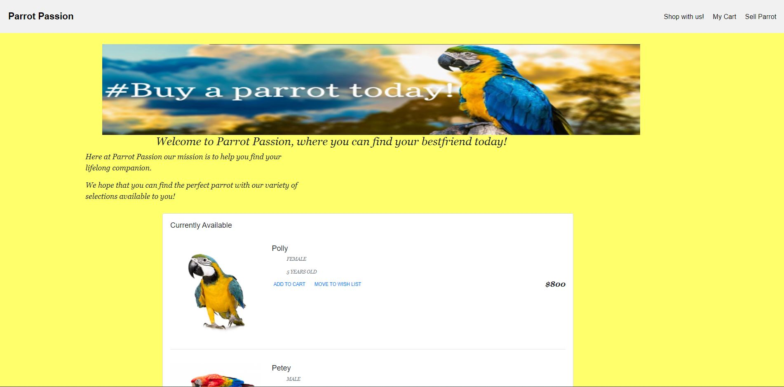
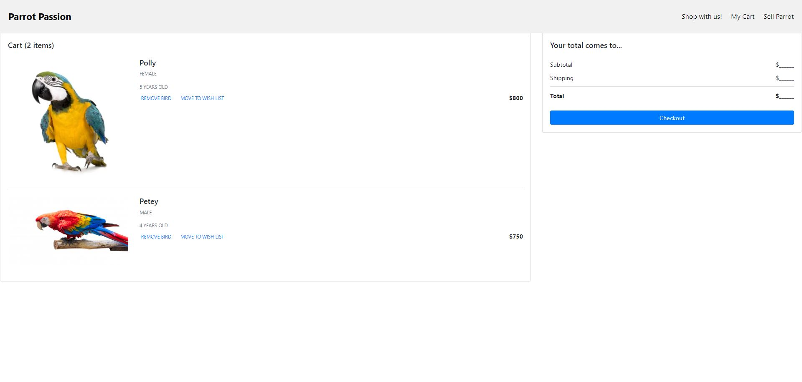
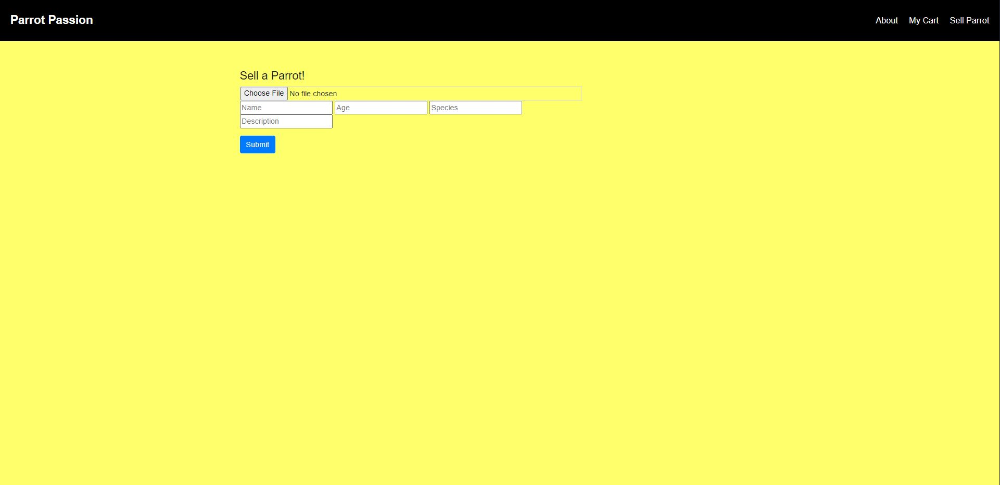

# Parrot Passion

## Description
Fake ecommerce website created with three other classmates to gain experience and knowlege in websites that revolve around buying and selling products

## Table of Contents

- [License](#license)

- [Installation](#installation)

## License

This project is licensed under GNU General Public License v2.0

## Installation

Installation Instructions:

npm install, mysql login, npm start

## Questions

If you have any questions about the repo, open an issue or contact me directly at isacjped@gmail.com. You can find more of my work at (https://github.com/Isac-Pederson/)

